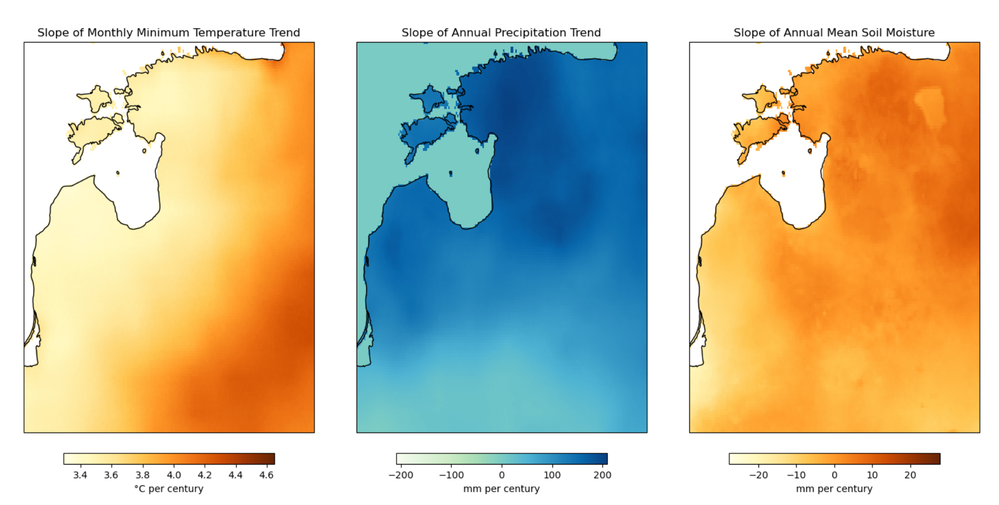
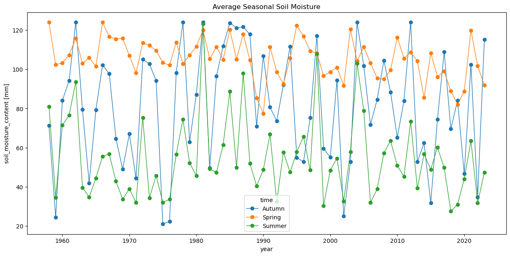

# Climate Trends for the Baltics

## Overview

Analysis of long-term climate trends across Estonia, Latvia, and Lithuania using the TerraClimate dataset, covering monthly observations from 1958 to 2023. The project quantified multi-decadal trends in temperature, precipitation, evapotranspiration, and soil moisture, and delivers spatial trend maps as GeoTIFF outputs for downstream use. The project also leveraged open-data and open-source cloud-native geospatial technologies to achieve this without any proprietary vendor lock-in.

**Study Area:** Baltic countries (Estonia, Latvia, Lithuania)  
**Duration:** December 2024  
**Role:** Solo project  
**Client:** Geolynx  
**Status:** Completed
---

## Methods & Tools

**Data Sources**

- [TerraClimate](http://www.climatologylab.org/terraclimate.html) — monthly global climate dataset at ~4 km resolution, accessed via OPeNDAP remote streaming (1958–2023)
- [GeoBoundaries CGAZ](https://github.com/wmgeolab/geoBoundaries) — administrative boundaries for clipping to the Baltic region

**Processing Steps**

1. Download administrative boundaries for Estonia, Latvia, and Lithuania and derive the bounding box
2. Stream TerraClimate variables (tmax, tmin, ppt, aet, soil) from the remote THREDDS server using XArray with Dask for lazy, chunked loading
3. Subset the global dataset to the Baltic bounding box and aggregate to annual means or sums
4. Fit a degree-1 polynomial trendline per pixel using `polyfit` to compute the slope (change per century)
5. Clip the slope rasters to the country boundaries using rioxarray and export as GeoTIFF; export annual aggregates as NetCDF

**Tools Used**

| Tool | Purpose |
|------|---------|
| XArray + Dask | Remote streaming and lazy parallel computation on large NetCDF datasets |
| rioxarray | CRS assignment, spatial clipping, and GeoTIFF export |
| GeoPandas | Loading and filtering administrative boundaries |
| Matplotlib + Cartopy | Spatial visualisation of trend maps and time-series plots |

---

## Key Findings

- Maximum and minimum temperatures across all three Baltic countries show a consistent warming trend detectable over the 65-year record
- Spatial variability in warming rates is visible at the ~4 km TerraClimate resolution, with coastal and inland areas showing different magnitudes
- Annual precipitation and actual evapotranspiration trends vary across the region, reflecting differential changes in the water cycle
- Soil moisture trends indicate seasonal shifts, with spring and summer patterns diverging from autumn trends

---

## Outputs

Annual and Seasonal Trend charts were generated for each of the variables.

Slope rasters for each variable were delivered as GeoTIFF files clipped to the Baltic boundary, along with annual aggregated subsets in NetCDF format for further analysis.

---

## Links

[Computing Pixel-Wise Long-Term Climate Trends Tutorial](https://www.geopythontutorials.com/notebooks/xarray_climate_trends.html){ .md-button }
