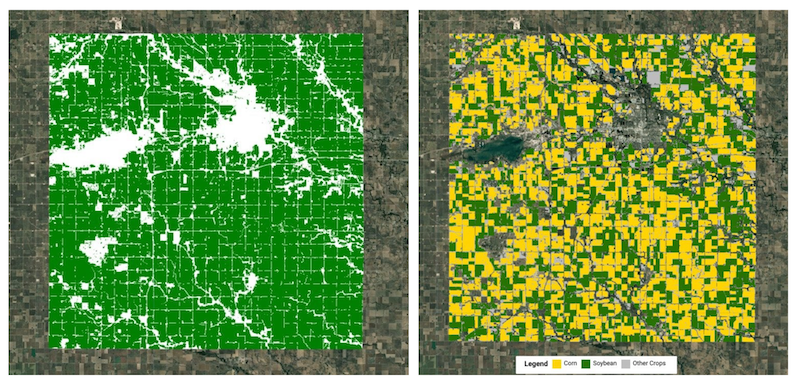

# Google AlphaEarth Embeddings (AEF) Tutorials

## Overview

A set of 5 tutorials developed in collaboration with the Google DeepMind team for the official launch of Google's Satellite Embedding dataset on Google Earth Engine. The tutorials cover the full spectrum of downstream tasks — from unsupervised clustering to similarity search — and are published in the Google Earth Engine Developer Guide.

**Study Area:** Global  
**Duration:** January 2025 – July 2025  
**Role:** Solo project  
**Status:** Completed

---

## Tutorials

1. [Introduction to the Satellite Embedding Dataset](https://developers.google.com/earth-engine/tutorials/community/satellite-embedding-01-introduction)
2. [Unsupervised Classification](https://developers.google.com/earth-engine/tutorials/community/satellite-embedding-02-unsupervised-classification)
3. [Supervised Classification](https://developers.google.com/earth-engine/tutorials/community/satellite-embedding-03-supervised-classification)
4. [Regression](https://developers.google.com/earth-engine/tutorials/community/satellite-embedding-04-regression)
5. [Similarity Search](https://developers.google.com/earth-engine/tutorials/community/satellite-embedding-05-similarity-search)

---

## Methods & Tools

**Data Sources**

- [Google Satellite Embedding Dataset (GOOGLE/SATELLITE_EMBEDDING/V1/ANNUAL)](https://developers.google.com/earth-engine/datasets/catalog/GOOGLE_SATELLITE_EMBEDDING_V1_ANNUAL) — annual 64-band embedding images from 2017 onward, derived from Sentinel-1, Sentinel-2, and Landsat time-series

**Tools Used**

| Tool | Purpose |
|------|---------|
| Google Earth Engine (JavaScript API) | Dataset access, processing, and visualization |

---

## Key Findings

- The 64-band embeddings capture both spatial context and annual temporal trajectories, producing cleaner land cover boundaries than traditional spectral indices
- Unsupervised clustering with as few as 5 clusters separates water bodies, seasonal wetlands, agricultural land, and built-up areas without any labelled training data
- Supervised models trained on embeddings achieve accurate crop type maps with minimal field samples, demonstrating the dataset's value for data-scarce regions
- Similarity search on embedding vectors identifies pixels with matching land-use patterns across large geographies in a single pass

---

## Geo for Good Summit 2025

Presented this work as an invited speaker at Google's Annual Geo for Good Summit in Singapore.

<iframe width="560" height="315" src="https://www.youtube.com/embed/6d4wXNEr4GY" title="Google Geo for Good Summit - AEF Tutorials" frameborder="0" allow="accelerometer; autoplay; clipboard-write; encrypted-media; gyroscope; picture-in-picture" allowfullscreen></iframe>

---

## Links

[View Tutorials on Google Earth Engine](https://developers.google.com/earth-engine/tutorials/community/satellite-embedding-01-introduction){ .md-button }
[View Dataset Catalog](https://developers.google.com/earth-engine/datasets/catalog/GOOGLE_SATELLITE_EMBEDDING_V1_ANNUAL){ .md-button }
